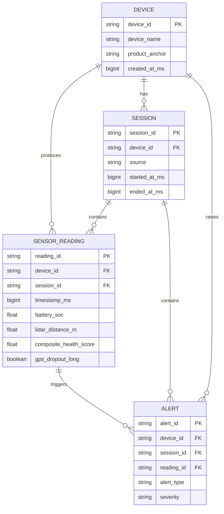

# Week 4 Dev Log

This week I completed the persistent database layer for the telemetry pipeline. I defined the SQLAlchemy models for devices, telemetry sessions, sensor readings, and alerts, including primary keys, foreign keys, and a unique constraint on `(device_id, timestamp_ms)`. I also added Alembic migrations and verified that a fresh database could upgrade to `head`, downgrade to `base`, and upgrade again successfully.

The main engineering improvement was replacing the earlier row-level loading path with an idempotent batched upsert workflow. The optimized loader preserved correctness while reducing the one-million-row load time from approximately 8.46 hours to 170.96 seconds. Throughput reached about 37,810 rows per second at 10,000 rows, 21,334 rows per second at 100,000 rows, and 5,849 rows per second at one million rows.

I benchmarked five representative queries before and after adding three targeted indexes. The query that benefited most from indexing was the GPS-dropout time-range query, and why it improved was clear from the query plan: the composite index on `(gps_dropout_long, timestamp_ms)` allowed SQLite to avoid a full-table scan and use a covering index for the requested fields. At one million rows, median latency decreased from 466.23 ms to 0.0756 ms, or approximately 6,167×. This result is query-specific and should not be interpreted as a 6,167× improvement to the entire database.

All 15 before-and-after query results were identical. The full suite finished with 49 tests passing, and black, flake8, and mypy all passed. Next week I will use these validated components as the foundation for the Phase C and Phase D work.
